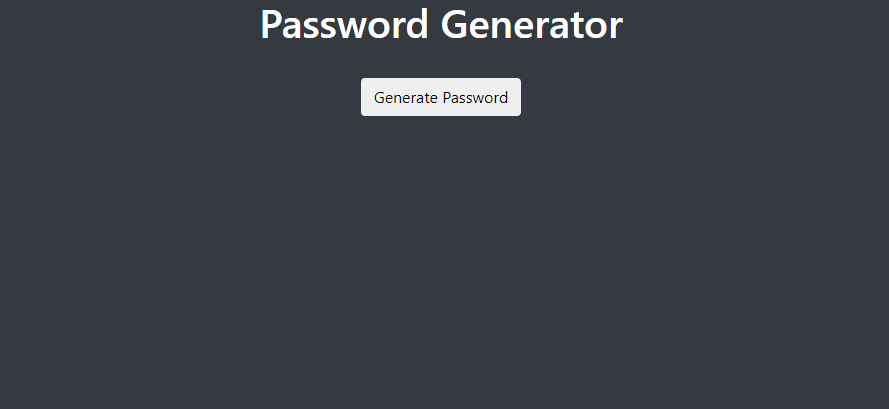

# Password Generator
## Description
### In this project I made apassword generator that generates passwords based on user input. A user can select uppercase, lowercase, special characters, numbers, and length.
### Input validation is performed  

### Here is a link to the deployed application
[https://corbinjarms.github.io/password-generator/](https://corbinjarms.github.io/password-generator/)
- - -
© 2019 Trilogy Education Services, a 2U, Inc. brand. All Rights Reserved.